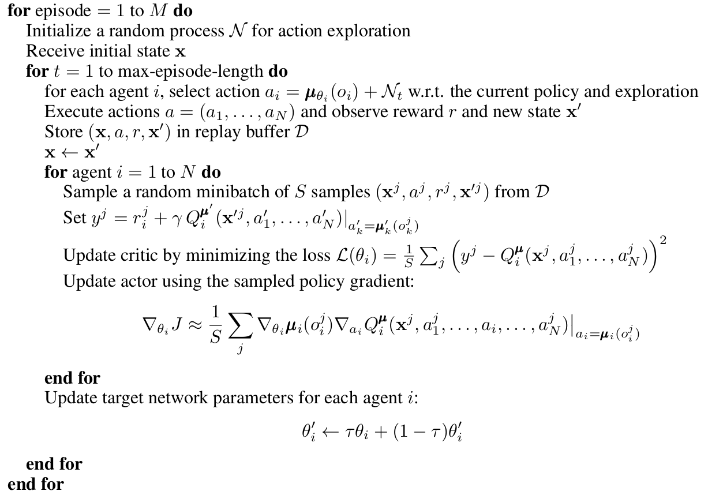

# Multi-Agent-Generative-Network (MAGNET)
MAGNET is a multi agnet cooperative learning based architecture for generating new images. MAGNET generates images similar to images in [CelebA](https://mmlab.ie.cuhk.edu.hk/projects/CelebA.html) dataset.

## Theory
The algorithm of multi-agent cooperative learning is inspired from [Multi-Agent Actor-Critic for Mixed Cooperative-Competitive Environments](https://arxiv.org/abs/1706.02275). 

### Environment
* **Current State:**
A random set of images (episode) sampled from the dataset.
* **New State:**
A random set of images (episode), different from current state, sampled from the dataset.

### Networks
MAGNET consists of 5 networks in total, namely:
* **Generator Actor (Ga):**
Takes current state (a image) as input, has a series of CNNs and LSTM at the end. It outputs a hidden state vector for next state (z).
* **Generator (G):**
This network is a series of DeConvolution layers, given a hidden state it outputs a image.
* **Generator Critic (Gc):**
Given the hidden state vector and current state, it outputs the q-value.
* **Discriminator Actor (Da):**
Given an image, this network predicts if the image is real (x) or fake (G(x)).
* **Discriminator Critic (Dc):**
Give the prediction of Discriminator Actor (policy) and the current state (Discriminator Actor input), it outputs the q-value.

### Returns
* **Generator Return:**
log(Da(G(z))
* **Discriminator Return:**
log(Da(x)) + log(1 – Da(G(z)))

### Algorithms
* The Generator Actor-Critic networks use DDPG as the hidden state is continuous.
* The Discriminator Actor-Critic networks use Actor-Critic as the output of Da is either '0' or '1'.
* **Multi-Agent DDPG for N-Agents:**

----------------------------------------------------------------------------------------------------------------------------------------
## Implementation 
* **Python Version:** 3.8
* The network is trained on NVIDIA RTX 3070 8GB laptop GPU and trining time for 50 epochs is around 2 hours.

### Dependencies
All the dependencies can be installed using the command

    pip3 install -r requirements.txt
    
### Datasets
* The code uses CelebA dataset. 
* In the MAGNET directory create a directory named 'data'.
* The dataset can be manually downloaded from [this link](https://mmlab.ie.cuhk.edu.hk/projects/CelebA.html). For manual download, use the aligned and cropped dataset. Unzip the dataset to 'data/celeba'.
* The dataset is automatically downloaded to 'data' directory by running 

      python3 download_celeba.py
      
### Training
* The training parameters can be changed in the file named 'train.py'
* To start training use the command

      python3 train.py
      
* Checkpoints are saved in 'models' directory with timestamp.

### Results
The training results for a fixed random noise

